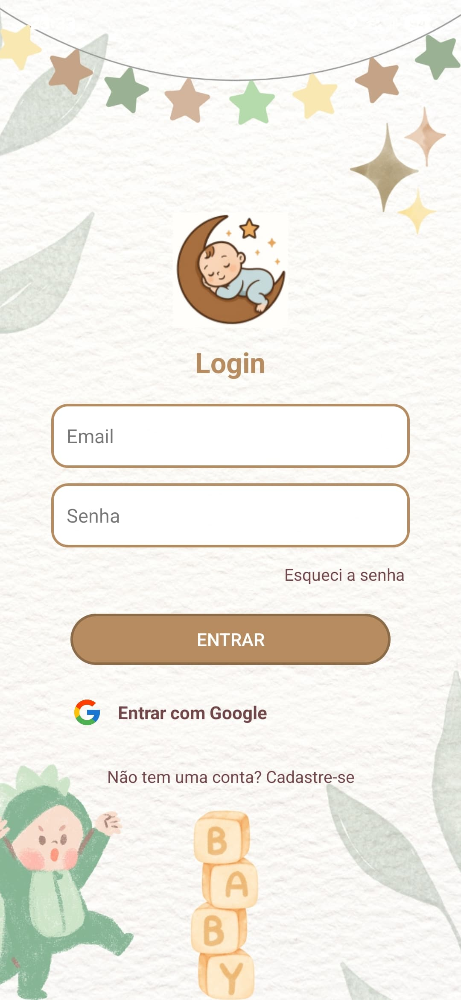
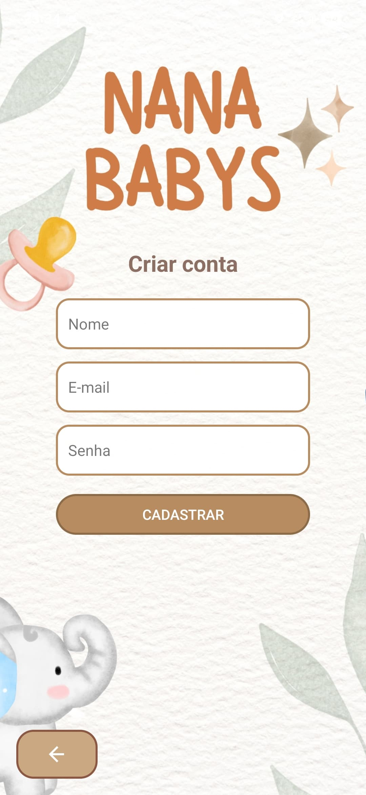
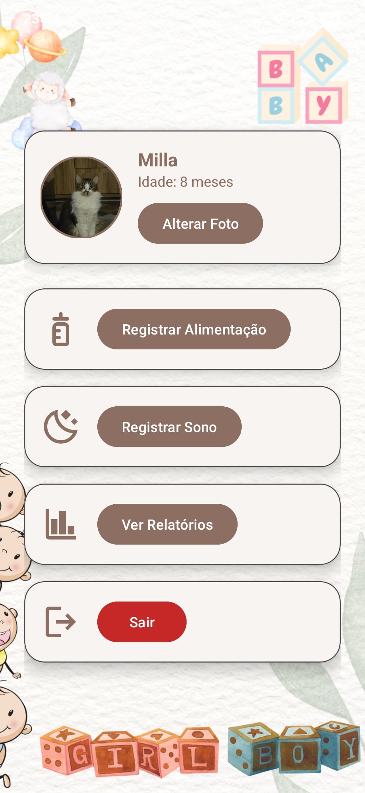

  

  <b>Um aplicativo para monitorar a rotina do seu bebê de forma simples e intuitiva.</b>

  
  

## 📋 Sobre o Projeto

O *NanaBabys* é um aplicativo mobile Android que tem como objetivo ajudar pais, mães e responsáveis a acompanharem a rotina do bebê. Com ele, é possível registrar horários de sono e alimentação, gerando relatórios de forma simples e intuitiva para entender melhor os hábitos da criança.

Este projeto foi desenvolvido com foco em aprender e aplicar conceitos modernos de desenvolvimento Android.

---

## 👥 A Equipe por Trás do NanaBabys

* [*Isabella Rodrigues](https://www.linkedin.com/in/isabella-rodrigues-7486642a7/) - *Idealizadora & Desenvolvedora Principal
    * Criou o conceito, o nome e a identidade visual do NanaBabys. Foi responsável pela arquitetura completa do aplicativo, desenvolvimento em Kotlin e integração com o backend Firebase.

* *Lucas Paiva* – UI/UX Designer & QA
    * Colaborou no design da experiência do usuário (UX) e realizou os testes de usabilidade e funcionais para garantir a qualidade.

* *Jessye* – UI/UX Designer & QA
    * Focada na prototipação das interfaces (UI) e na garantia de qualidade, identificando e reportando bugs.

---

## ✨ Funcionalidades Principais

* ✔ *Autenticação Segura:* Cadastro e Login com E-mail/Senha e também via conta Google.
* ✔ *Perfil do Bebê:* Registro de dados como nome, sexo e data de nascimento.
* ✔ *Registro de Atividades:* Interface simples para registrar horários de *Alimentação* e *Sono*.
* ✔ *Relatórios Visuais:* Visualização dos dados registrados para acompanhar a evolução.
* ✔ *Personalização:* Edição da foto de perfil do bebê.
* ✔ *Gerenciamento de Conta:* Logout fácil para troca de usuário.

---

## 📱 Telas do Aplicativo

  
  
  

---

## 🛠 Tecnologias Utilizadas

- *Linguagem:* [Kotlin](https://kotlinlang.org/)
- *IDE:* [Android Studio](https://developer.android.com/studio)
- *Backend as a Service:* [Firebase](https://firebase.google.com/)
  - *Autenticação:* Firebase Authentication
  - *Banco de Dados:* Firebase Firestore (para salvar os dados)
- *UI/UX:* Material Design 3

---

## 🚀 Como Executar o Projeto

O aplicativo não está publicado na Play Store. Para testá-lo em seu ambiente de desenvolvimento, siga os passos abaixo:

#### *Pré-requisitos*

* [Android Studio](httpss://developer.android.com/studio) instalado.
* Um emulador Android (configurado via Android Studio) ou um dispositivo físico.
* Conta do [Firebase](https://firebase.google.com/).

#### *Passo a Passo*

1.  *Clone o repositório:*
    bash
    git clone [https://github.com/isabellrsf/NanaBabys.git](https://github.com/isabellrsf/NanaBabys.git)
    

2.  *Abra no Android Studio:*
    * Inicie o Android Studio.
    * Selecione *"Open an Existing Project"*.
    * Navegue até a pasta onde você clonou o repositório e selecione-a.
    * Aguarde o Gradle sincronizar o projeto.

3.  *Configure o Firebase (Passo Essencial!):*
    * Acesse o [console do Firebase](https://console.firebase.google.com/) e crie um novo projeto.
    * Adicione um novo aplicativo Android a este projeto. O "package name" deve ser com.isabella.sleepbaby (você pode confirmar isso no arquivo app/build.gradle).
    * Habilite os métodos de autenticação que você usa: *E-mail/Senha* e *Google*.
    * Após registrar o app no Firebase, faça o download do arquivo google-services.json.
    * *Copie* este arquivo google-services.json e *cole* dentro da pasta app do seu projeto no Android Studio.

4.  *Execute o Aplicativo:*
    * Com o Firebase configurado, agora é só clicar no botão de "Run" (▶) no Android Studio, selecionando um emulador ou seu dispositivo físico.

## 📄 Licença

Este projeto está sob a licença MIT. Veja o arquivo [LICENSE](LICENSE) para mais detalhes.
